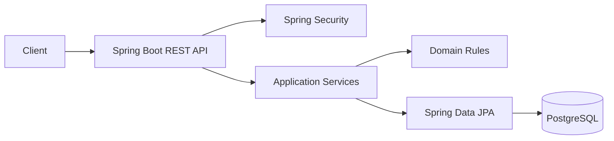

# Plano Mestre de Implementação — GerenciamentíssimoFlow V1
## Java Project #1 — Backend profissional para portfólio
### Spring Boot + PostgreSQL + Segurança + Transações + Concorrência + Testcontainers + Docker + CI

> Use junto com `AUTONOMIA.md` (documento de governança aprovado; referência antiga preservada no histórico).
>
> Este plano é o backlog persistente e a memória de execução do Zoo Code.
>
> Objetivo: criar um projeto Java público que demonstre competência de backend em profundidade, não apenas CRUD.

---

# 0. Identidade

Nome público:

# **GerenciamentíssimoFlow**

Subtítulo sugerido:

> Gestão de estoque, pedidos e operações B2B com Java e Spring Boot.

Descrição curta para GitHub:

> API REST de gestão operacional com estoque multi-depósito, pedidos transacionais, autenticação JWT, RBAC, PostgreSQL, Flyway, concorrência, idempotência, auditoria, Testcontainers, Docker e CI.

Identificadores técnicos:

```text
repository: gerenciamentissimoflow
groupId: com.dreagas
artifactId: gerenciamentissimoflow
package: com.dreagas.gerenciamentissimoflow
image: gerenciamentissimoflow
```

O nome com acento deve ser usado na apresentação humana.

Identificadores técnicos permanecem ASCII.

---

# 1. Objetivo de portfólio

O projeto deve provar domínio de:

- Java moderno;
- Spring Boot;
- Spring Web;
- Spring Security;
- JWT;
- RBAC;
- Bean Validation;
- JPA/Hibernate;
- PostgreSQL;
- Flyway;
- modelagem de domínio;
- transações;
- concorrência;
- idempotência;
- paginação;
- busca/filtros;
- tratamento de erros;
- auditoria;
- Actuator;
- OpenAPI/Swagger;
- JUnit 5;
- Mockito;
- Testcontainers;
- Maven;
- Docker;
- Docker Compose;
- GitHub Actions;
- documentação técnica;
- práticas de segurança;
- preparação para deploy.

O diferencial central será:

> **pedido + estoque + concorrência + idempotência implementados e testados de verdade.**

---

# 2. Problema de negócio

O GerenciamentíssimoFlow representa uma aplicação de gestão operacional para uma pequena/média empresa B2B.

Ela precisa controlar:

- usuários;
- papéis;
- categorias;
- produtos;
- fornecedores;
- depósitos;
- saldo por depósito;
- movimentações;
- pedidos;
- itens;
- reserva/baixa/liberação de estoque;
- auditoria;
- alertas de estoque baixo;
- dashboard operacional;
- relatórios.

O sistema deve parecer um produto plausível de uma empresa real.

Não transformar o domínio em ERP gigantesco.

---

# 3. Stack

Antes do bootstrap, verificar documentação oficial atual.

Critérios:

- preferir Java LTS com forte adoção profissional;
- preferir Spring Boot estável e compatível;
- preferir versões maduras a versões recém-lançadas quando houver trade-off;
- registrar versões escolhidas no README.

Stack alvo:

- Java LTS;
- Spring Boot;
- Maven Wrapper;
- Spring Web;
- Spring Security;
- Spring Validation;
- Spring Data JPA;
- PostgreSQL;
- Flyway;
- Spring Boot Actuator;
- OpenAPI/Swagger via integração compatível;
- JUnit 5;
- Mockito;
- Spring Boot Test;
- Spring Security Test;
- Testcontainers PostgreSQL;
- JaCoCo;
- Docker;
- Docker Compose;
- GitHub Actions.

Dependência adicional exige justificativa.

---

# 4. Arquitetura

Começar como **monólito modular**.

Package base:

```text
com.dreagas.gerenciamentissimoflow
```

Estrutura sugerida:

```text
com.dreagas.gerenciamentissimoflow
├── auth
├── user
├── category
├── product
├── supplier
├── warehouse
├── inventory
├── order
├── audit
├── dashboard
├── config
└── shared
```

Dentro de cada módulo, criar somente as subdivisões necessárias.

Exemplo:

```text
product/
├── Product.java
├── ProductRepository.java
├── ProductService.java
├── ProductController.java
├── dto/
└── ...
```

Não criar estrutura gigantesca antes de ter código.

---

# 5. Papéis

Papéis da V1:

```text
ADMIN
MANAGER
OPERATOR
```

## ADMIN

Pode:

- gerenciar usuários;
- gerenciar cadastros;
- operar estoque;
- operar pedidos;
- consultar auditoria;
- consultar dashboard completo.

## MANAGER

Pode:

- gerenciar produtos;
- categorias;
- fornecedores;
- depósitos;
- estoque;
- pedidos;
- dashboard operacional.

## OPERATOR

Pode:

- consultar produtos;
- consultar estoque;
- registrar operações explicitamente permitidas;
- trabalhar com pedidos conforme regra;
- não gerenciar usuários;
- não acessar auditoria administrativa.

Todas as regras devem existir no backend.

---

# 6. Entidades principais

## User

Campos mínimos:

```text
id
name
email
passwordHash
role
enabled
createdAt
updatedAt
```

Regras:

- e-mail único;
- senha nunca retornada;
- passwordHash nunca retornado;
- usuário pode ser desativado;
- usuário já referenciado em auditoria não é apagado de forma destrutiva.

---

## Category

```text
id
name
active
createdAt
updatedAt
```

Nome deve ser único de forma coerente.

---

## Product

```text
id
sku
name
description
category
referencePrice
minimumStock
active
createdAt
updatedAt
```

Regras:

- SKU único;
- preço `BigDecimal`;
- estoque mínimo >= 0;
- produto usado em histórico não deve ser apagado destrutivamente;
- inativação é preferível.

---

## Supplier

Campos mínimos úteis:

```text
id
name
document
email
phone
active
createdAt
updatedAt
```

Não adicionar dezenas de dados cadastrais.

Documento pode ser string validada de forma razoável, sem transformar a V1 em módulo fiscal.

---

## Warehouse

```text
id
code
name
location
active
createdAt
updatedAt
```

Código único.

---

## InventoryBalance

```text
id
product
warehouse
quantity
version
updatedAt
```

Constraint:

```text
UNIQUE(product_id, warehouse_id)
```

O saldo nunca deve ficar negativo.

---

## StockMovement

```text
id
product
warehouse
type
quantity
balanceBefore
balanceAfter
reason
referenceType
referenceId
actorUserId
createdAt
```

Tipos iniciais:

```text
IN
OUT
ADJUSTMENT
RESERVATION
RELEASE
```

---

## Order

```text
id
number
status
warehouse
createdBy
total
createdAt
updatedAt
confirmedAt
fulfilledAt
cancelledAt
version
```

Estados:

```text
DRAFT
CONFIRMED
FULFILLED
CANCELLED
```

---

## OrderItem

```text
id
order
product
quantity
unitPrice
lineTotal
```

O total é calculado no servidor.

---

## AuditEvent

```text
id
actorUserId
action
resourceType
resourceId
metadata
createdAt
```

Nunca guardar secrets.

---

## IdempotencyRecord

Quando F-04 for implementada:

```text
id
key
operation
requestFingerprint
resourceId
responseStatus
createdAt
expiresAt
```

A modelagem final pode variar após análise técnica.

---

# 7. Regras de negócio importantes

## 7.1 Produtos

- SKU único;
- preço não negativo;
- estoque mínimo não negativo;
- produto inativo não entra em novos fluxos operacionais incompatíveis;
- histórico permanece legível.

## 7.2 Estoque

Saldo é por:

```text
produto + depósito
```

Toda mudança importante gera movimentação.

Não permitir:

- quantidade zero em entrada/saída;
- quantidade negativa quando a operação exige positiva;
- saldo negativo;
- ajuste sem motivo;
- operação em produto/depósito inválido.

## 7.3 Pedidos

Estado inicial:

```text
DRAFT
```

Transições da V1:

```text
DRAFT -> CONFIRMED
DRAFT -> CANCELLED
CONFIRMED -> FULFILLED
CONFIRMED -> CANCELLED
```

`FULFILLED` e `CANCELLED` são finais na V1.

Transições inválidas retornam conflito de domínio.

## 7.4 Confirmação

Confirmação deve:

1. validar pedido;
2. validar estado;
3. validar itens;
4. validar produtos ativos;
5. validar depósito;
6. validar saldos;
7. aplicar reserva/baixa conforme estratégia;
8. registrar movimentos;
9. atualizar pedido;
10. registrar auditoria;
11. concluir na mesma transação.

Falha:

- rollback integral.

## 7.5 Cancelamento

Se pedido confirmado consumir/reservar estoque:

- cancelamento elegível deve liberar/reverter de maneira consistente;
- operação é transacional;
- não duplicar liberação em retry.

## 7.6 Fulfillment

Somente pedido `CONFIRMED`.

Registrar timestamp e auditoria.

---

# 8. Contrato HTTP

Base:

```text
/api/v1
```

Endpoints devem usar:

- JSON;
- paginação;
- validação;
- semântica HTTP;
- ProblemDetail quando compatível;
- OpenAPI.

Não expor entidade JPA diretamente.

---

# 9. FASE A — Bootstrap

## A-01 — Estado inicial

Status: `[x]`

- [ ] registrar branch;
- [ ] registrar commit inicial;
- [ ] executar `git status --short --branch`;
- [ ] verificar arquivos preexistentes;
- [ ] conferir `.gitignore`;
- [ ] procurar secrets sem imprimir valores;
- [ ] registrar estado no diário.

Aceite:

- baseline registrado;
- nenhuma alteração alheia perdida.

Não criar commit vazio.

---

## A-02 - Criar aplicação Spring Boot

Status: `[x]`

Criar projeto.

Configurar:

- [x] group/artifact;
- [x] package base;
- [x] Java 21 (LTS);
- [x] Spring Boot 4.0.8 (release estável disponível no Initializr consultado);
- [x] Maven Wrapper 3.3.4;
- [x] Web;
- [x] Validation;
- [x] Data JPA;
- [x] Security;
- [x] PostgreSQL;
- [x] Flyway;
- [x] Actuator;
- [x] test dependencies;
- [x] Testcontainers PostgreSQL/JUnit e integração Spring Boot;
- [ ] OpenAPI se compatível e estável (J-01).

Criar:

```text
GerenciamentissimoFlowApplication
```

Exibir nome de produto com acento somente na apresentação/configuração apropriada.

Teste:

```powershell
.\mvnw.cmd test
```

Commit:

```text
feat: bootstrap Spring Boot application
```

---

## A-03 - Configuração por profiles

Status: `[x]`

Criar/configurar:

```text
application.yml
application-dev.yml
application-test.yml
application-demo.yml
application-prod.yml
```

Regras:

- [x] nenhum secret real;
- [x] prod exige secrets externos para DB;
- [x] test usa banco local isolado, sem referência a DB remota;
- [x] demo identificado como dado fictício.

Commit:

```text
feat: configure application profiles
```

---

## A-04 — PostgreSQL local

Status: `[x]`

Criar:

```text
compose.yaml
```

Com:

- PostgreSQL;
- healthcheck;
- volume local nomeado;
- configuração dev;
- zero secret real.

Testar:

```powershell
docker compose config
docker compose up -d
docker compose ps
```

Confirmar conexão da app.

Não apagar volume.

Commit:

```text
feat: add local PostgreSQL environment
```

---

# 10. FASE B — Persistência e base compartilhada

## B-01 - Flyway baseline

Status: `[x]`

- [x] configurar Flyway;
- [x] migration inicial para usuário/categoria/produto;
- [x] schema parte de DB vazia (validado em PostgreSQL local);
- [x] constraints essenciais para as tabelas iniciais;
- [x] índice para FK de categoria em produtos;
- [x] app inicia com migration (validado em PostgreSQL local).

Não usar `ddl-auto=create` em prod.

Commit:

```text
feat: add Flyway database baseline
```

---

## B-02 - Erros da API

Status: `[x]` (ProblemDetail cobre validation, not found, conflict, authentication/authorization, malformed JSON, business-rule input e unexpected; handlers de conflito de domínio e integridade sanitizam respostas)

Criar tratamento centralizado.

Cobrir:

- validation;
- not found;
- [x] conflict;
- [x] authentication;
- [x] authorization;
- malformed JSON;
- [x] business rule;
- unexpected error.

Preferir Spring `ProblemDetail` se compatível.

Campos extras seguros:

```text
code
fieldErrors
timestamp
```

Testes obrigatórios.

Commit:

```text
feat: standardize API error responses
```

Validação final: `mvnw.cmd -q -Dtest=ApiExceptionHandlerTest test` -> PASS; commit `1d6ab19`.

---

## B-03 - Auditoria base de timestamps

Status: `[x]`

Padronizar:

- [x] createdAt;
- [x] updatedAt;
- [x] Instant/UTC.

Não complicar com framework próprio.

Commit:

```text
feat: standardize entity timestamps
```

---

# 11. FASE C — Usuários e segurança

## C-01 - User persistence

Status: `[x]`

Implementar User.

- [x] e-mail normalizado;
- [x] unique constraint no mapeamento/migration (necessita validar no DB);
- [x] password hash armazenado sem exposição DTO;
- [x] role;
- [x] enabled;
- [x] timestamps herdados.

Testes de repository/constraint.

Commit:

```text
feat: add user persistence
```

---

## C-02 — JWT authentication

Status: `[x]` (implementation/configuration reviewed locally; focused security tests pass; production use remains gated on external secrets and human security review)

Implementar:

```text
POST /api/v1/auth/login
```

Implementation complete for local/demo application behavior; do not treat production readiness as satisfied until an independent security review is recorded and production secrets are supplied through the approved deployment environment.

Requisitos:

- e-mail;
- senha;
- PasswordEncoder;
- JWT assinado;
- expiração;
- segredo por ambiente;
- resposta mínima;
- 401 sem enumeração desnecessária.

Testar:

- login válido;
- senha inválida;
- usuário inexistente;
- usuário desativado;
- token inválido;
- token expirado;
- segredo crítico ausente em prod.

Commit:

```text
feat: implement JWT authentication
```

---

## C-03 — RBAC

Status: `[x]` (stage 1: administrator-only user listing; role coverage implemented)

Aplicar:

- ADMIN;
- MANAGER;
- OPERATOR.

Testes positivos e negativos.

Não confiar no cliente.

Commit:

```text
feat: enforce role based access control
```

---

## C-04 — Usuário atual

Status: `[x]`

Endpoint:

```text
GET /api/v1/me
```

Retorno mínimo:

- id;
- name;
- email;
- role.

Nunca:

- hash;
- token interno;
- campos sensíveis.

Commit:

```text
feat: add authenticated user endpoint
```

### 2026-10-07 - C-04 current-user endpoint

Status: DONE

Implemented GET `/api/v1/me` resolving current principal identity against persisted users; only id, name, email, role are serialized. Missing principal record maps to safe 404. HTTP test covers authenticated response and excludes password hash.

Tests: focused HTTP tests, full `mvnw.cmd -q test`, and `mvnw.cmd -q verify` all PASS including Testcontainers.

Commit: `5335bac feat: add inventory balances`.

---

# 12. FASE D — Cadastros

## D-01 — Categorias

Status: `[x]`

Endpoints CRUD apropriados: create, paginated list/search, detail, rename/update and soft deactivation.

Requisitos:

- nome;
- unicidade;
- uniqueness is case-insensitive and enforced by PostgreSQL;
- active;
- paginação;
- validação;
- autorização.

Commit:

```text
feat: add category management
```

### 2026-10-07 — D-01 Categorias

Status: DONE

Implementado: Category entity/service/repository/controller; create, paginated list with name/status filters, detail, rename and soft-deactivate routes under `/api/v1/categories`. Category names are trimmed, non-blank and unique case-insensitively. Domain conflict/not-found responses are mapped to safe ProblemDetail. ADMIN and MANAGER may manage categories; OPERATOR may read only.

Migration: V2 drops the case-sensitive constraint from V1 and adds unique index on `LOWER(name)`; V1 was preserved.

Testes: focused CategoryTest/CategoryRepositoryIntegrationTest, `mvnw.cmd -q test`, `mvnw.cmd -q verify` -> PASS. PostgreSQL Testcontainers validated migration, case-insensitive uniqueness, persistence and paginated filtering.

Decisão: first full-suite attempt found that the prior API HTTP/context tests replaced UserRepository only; introducing a real category controller then exposed the same missing-bean assumption for CategoryRepository. Added CategoryRepository test doubles in those context fixtures; subsequent full suite and verify passed.

Commits: `91392df feat: add category management`; `e0145b1 docs: record category stage completion`; `2e9f3b2 docs: link category checkpoint to commit`; mapping fixes `21d3dde fix: align category mapping with functional unique index`, `c54aa80 fix: normalize category names consistently`.

Próximo: D-02 Produtos.

---

## D-02 — Produtos

Status: `[x]`

Implementar:

- create;
- update;
- get;
- list;
- search;
- filter;
- sort;
- pagination;
- deactivate.

Filtros:

- nome/SKU;
- categoria;
- active.

Regras:

- SKU único;
- BigDecimal;
- minimumStock;
- category válida.

Commit:

```text
feat: add product management
```

### 2026-10-07 — D-02 Produtos

Status: DONE

Implementado: product entity/service/repository/controller with create, update, detail, paginated search/list, filter by name/SKU, category and active, plus soft-deactivation. SKU is uppercased and database-unique; price is BigDecimal bounded to PostgreSQL numeric(19,4), minimum stock is non-negative, and category references must resolve to active categories. Category/product API permissions now allow read to all 3 roles and catalog writes to ADMIN/MANAGER.

Migration changes in forward V2 add DB non-blank checks for product name/SKU; Product retains the existing V1 columns and unique SKU constraint.

Tests: ProductTest, ProductRepositoryIntegrationTest, ApiHttpIntegrationTest, full `mvnw.cmd -q test`, and `mvnw.cmd -q verify` -> PASS. PostgreSQL Testcontainers checked SKU uniqueness and numeric persistence. `git diff --check` -> PASS.

Commit: `07a4231 feat: add product management`; product filter fix `58e7a6d fix: keep product category search filters combined`.

Próximo: D-04 Depósitos.

---

## D-03 — Fornecedores

Status: `[x]`

Implementar:

- cadastro;
- edição;
- detalhe;
- listagem;
- busca;
- status.

Validar:

- name;
- email quando informado;
- document quando informado.

Não implementar módulo fiscal.

Commit:

```text
feat: add supplier management
```

### 2026-10-07 — D-03 Fornecedores

Status: DONE

Implementado: supplier entity/service/repository/controller with create, update, detail, paginated list/search and soft-deactivation. Optional email/document/phone normalize blank values to null; email is validated and normalized lowercase. Read access is available to ADMIN/MANAGER/OPERATOR; writes to ADMIN/MANAGER.

Migration: additive forward migration V3 creates the supplier table; committed V2 was left unchanged.

Tests: `mvnw.cmd -q -Dtest=SupplierTest,SupplierRepositoryIntegrationTest test` -> PASS; `mvnw.cmd -q verify` -> PASS, including PostgreSQL Testcontainers; `git diff --check` -> PASS.

Commit: `d6c9dae feat: add supplier management`.

Próximo: D-04 Depósitos.

---

## D-04 — Depósitos

Status: `[x]`

Implementar:

- create;
- update;
- get;
- list;
- active/inactive.

Regras:

- code único;
- name;
- location.

Commit:

```text
feat: add warehouse management
```

### 2026-10-07 — D-04 Depósitos

Status: DONE

Implementado: warehouse entity/service/repository/controller with create, update, get, pageable listing/search, active filtering and soft-deactivation. Codes are trimmed and uppercased, required fields are validated, and duplicates map to a safe conflict response. Read access is granted to ADMIN/MANAGER/OPERATOR; writes to ADMIN/MANAGER.

Migration: additive V4 creates warehouse and enforces unique/nonblank code, nonblank name and location.

Tests: `mvnw.cmd -q -Dtest=WarehouseTest,WarehouseRepositoryIntegrationTest test` -> PASS; `mvnw.cmd -q verify` -> PASS with PostgreSQL Testcontainers; `git diff --check` -> PASS.

Commit: `30f85c9 feat: add warehouse management`.

Próximo: E-01 InventoryBalance.

---

# 13. FASE E — Estoque

## E-01 — InventoryBalance

Status: `[x]`

Implementar saldo por:

```text
product + warehouse
```

Requisitos:

- unique constraint;
- quantity;
- version;
- updatedAt;
- nunca negativo.

Criar testes.

Commit:

```text
feat: add inventory balances
```

### 2026-10-07 — E-01 InventoryBalance

Status: DONE

Implementado: inventory balance entity links product and warehouse, enforces one row per pair, stores nonnegative quantity and uses JPA optimistic `@Version` for concurrent updates. Repository provides lookup by product/warehouse identifiers.

Migration: additive V5 creates `inventory_balance` with foreign keys, unique product/warehouse pair, version and database CHECK for nonnegative quantity.

Tests: `mvnw.cmd -q -Dtest=InventoryBalanceTest,InventoryBalanceRepositoryIntegrationTest test` -> PASS; Testcontainers verified persistence, pair uniqueness and database-side negative-quantity rejection.

Commit: `5335bac feat: add inventory balances`.

Próximo: E-02 Entrada.

---

## E-02 — Entrada

Status: `[x]`

Endpoint conceitual:

```text
POST /api/v1/inventory/receipts
```

Entrada:

- productId;
- warehouseId;
- quantity;
- reason/reference opcional.

Regras:

- quantity > 0;
- recursos ativos;
- transação;
- saldo;
- movimento;
- audit event.

Commit:

```text
feat: implement stock receipts
```

### 2026-10-07 — E-02 Entrada

Status: DONE

Implementado: transactional receipt endpoint validates positive quantities and active product/warehouse, locks an existing balance row, atomically increments or initializes it, and writes an immutable receipt movement with optional reference/reason.

Migration: additive V6 creates inventory movement history with positive quantity constraint. No committed migration was edited.

Tests: `mvnw.cmd -q -Dtest=InventoryServiceTest,InventoryReceiptIntegrationTest test` -> PASS; `mvnw.cmd -q verify` -> PASS after wiring inventory repository mocks into HTTP slice context; Testcontainers verified movement and updated balance in one transaction.

Commit: `f9aab43 feat: implement stock receipts`.

Próximo: E-03 Ajuste manual.

---

## E-03 — Ajuste manual

Status: `[x]`

Endpoint conceitual:

```text
POST /api/v1/inventory/adjustments
```

Regras:

- papel autorizado;
- motivo obrigatório;
- novo saldo/ajuste conforme contrato claro;
- sem saldo negativo;
- transação;
- movimento;
- auditoria.

Commit:

```text
feat: implement audited stock adjustments
```

### 2026-10-07 — E-03 Ajuste manual

Status: DONE

Implementado: ADMIN-only manual target-balance adjustment endpoint requires a reason, rejects negative/no-op adjustments, locks the balance transactionally, and records an ADJUSTMENT movement for the absolute delta. This preserves the nonnegative invariant and immutable movement history.

Tests: `mvnw.cmd -q -Dtest=InventoryServiceTest,InventoryReceiptIntegrationTest test` -> PASS; full `mvnw.cmd -q verify` to be rerun before commit.

Commit: `a0e5ef6 feat: implement audited stock adjustments`.

Próximo: E-04 Consulta de saldo.

---

## E-04 — Consulta de saldo

Status: `[x]`

Listagem com:

- paginação;
- produto;
- depósito;
- categoria;
- baixo estoque;
- sem estoque;
- ordenação.

Definição de baixo estoque:

```text
quantity <= product.minimumStock
```

Documentar.

Commit:

```text
feat: add inventory queries
```

### 2026-10-07 — E-04 Consulta de saldo

Status: DONE

Implementado: paginated balance listing supports optional product, warehouse and category IDs, low-stock (`quantity <= minimumStock`) and out-of-stock filters; response includes identifying product/warehouse data and both computed stock flags.

Tests: `mvnw.cmd -q -Dtest=InventoryBalanceRepositoryIntegrationTest test` -> PASS on PostgreSQL Testcontainers; `mvnw.cmd -q verify` -> PASS.

Commit: `c39758b feat: add inventory balance queries`.

Próximo: E-05 Histórico de movimentos.

---

## E-05 — Histórico de movimentos

Status: `[x]`

Filtros:

- product;
- warehouse;
- movement type;
- period;
- actor quando permitido.

Paginação obrigatória.

Commit:

```text
feat: add stock movement history
```

### 2026-10-07 — E-05 Histórico de movimentos

Status: DONE

Implementado: paginated read-only movement history with product, warehouse, type and time range filters, newest-first default, and safe DTO fields for reason/reference and quantity.

Tests: full `mvnw.cmd -q verify` -> PASS, including PostgreSQL Testcontainers inventory persistence/filter coverage.

Commit: `b3ca4c1`.

Próximo: F-01 Draft order.

---

# 14. FASE F — Pedidos

## F-01 — Draft order

Status: `[x]`

Implementar:

```text
POST /api/v1/orders
GET /api/v1/orders/{id}
GET /api/v1/orders
```

Pedido nasce `DRAFT`.

Campos/associações:

- warehouse;
- createdBy;
- itens.

Commit:

```text
feat: add draft order workflow
```

### 2026-10-07 — F-01 Draft order

Status: DONE.

Implementado draft workflow with warehouse, creator, empty item collection and server-owned zero total; added paginated list/detail/create endpoints, creator-scoped reads for OPERATOR and manager/admin cross-user reads, plus additive V7 schema.

Tests: focused order/API tests PASS; `mvnw.cmd -q verify` PASS including PostgreSQL Testcontainers.

Commit: `35e82c9`.

---

## F-02 — Itens

Status: `[x]`

Enquanto DRAFT:

- adicionar;
- alterar;
- remover.

Regras:

- produto ativo;
- quantity > 0;
- preço unitário definido conforme regra documentada;
- lineTotal no servidor;
- order total no servidor;
- BigDecimal.

Após confirmação:

- itens imutáveis na V1.

Commit:

```text
feat: add order item management
```

### 2026-10-07 — F-02 Itens do pedido

Status: DONE.

Implementado: draft-only add/update/remove item operations, active-product validation, positive quantities, bounded nonnegative `BigDecimal` unit prices, server-calculated line/order totals and creator/manager/admin authorization. Added fetch-joined order views to avoid lazy-loading serialization issues.

Tests: focused order/API tests PASS; full `mvnw.cmd -q verify` PASS, including Testcontainers PostgreSQL.

Commit: `175e33b`.

---

## F-03 — Confirmação transacional

Status: `[x]`

Endpoint sugerido:

```text
POST /api/v1/orders/{id}/confirm
```

Implementar como operação transacional.

Fluxo:

1. obter order;
2. validar DRAFT;
3. validar itens;
4. validar warehouse;
5. validar product;
6. obter saldos;
7. garantir disponibilidade;
8. reservar/baixar;
9. registrar movements;
10. atualizar status;
11. timestamps;
12. audit event;
13. commit transacional.

Em qualquer erro:

- rollback completo.

Testes obrigatórios:

- sucesso;
- estoque insuficiente;
- produto inativo;
- pedido sem item;
- status inválido;
- rollback.

Commit:

```text
feat: implement transactional order confirmation
```

### 2026-10-07 — F-03 Confirmação transacional

Status: DONE.

Implementado: order row lock, deterministic balance locks, complete availability validation before deduction, atomic order status transition and `ORDER_OUT` movement records referencing order ID; insufficient stock or invalid draft state rolls back the transaction.

Tests: focused order and inventory repository integration tests PASS; full `mvnw.cmd -q verify` PASS including PostgreSQL Testcontainers.

Commit: pending.

---

## F-04 — Concorrência contra overselling

Status: `[x]`

Esta etapa é obrigatória e deve ser bem documentada.

Cenário mínimo:

```text
estoque = 10

requisição A tenta confirmar 7
requisição B tenta confirmar 7
```

Resultado:

- não permitir 14;
- saldo final nunca negativo;
- estado dos pedidos coerente;
- uma falha deve ser tratada com erro de domínio previsível.

Analisar estratégia:

- optimistic locking;
- pessimistic locking;
- update condicional;
- combinação apropriada.

Escolher após teste real com PostgreSQL.

Não escolher apenas pela facilidade.

Criar teste concorrente com Testcontainers.

Documentar em:

```text
docs/DECISIONS.md
```

ou ADR.

Commit:

```text
fix: prevent concurrent stock overselling
```

### 2026-10-07 - F-04 Concorrência contra overselling

Status: DONE.

Implementado: teste de concorrência PostgreSQL/Testcontainers executa duas confirmações em transações independentes com saldo 10 e pedidos de 7. Uma confirma; a outra recebe `Insufficient stock`; saldo termina em 3, há uma única movimentação `ORDER_OUT` e o pedido perdedor permanece `DRAFT`. A implementação existente usa lock pessimista no pedido e locks de saldo ordenados por produto, valida disponibilidade integral antes de alterar saldos e mantém `@Version` como proteção otimista adicional.

Decisão registrada em `docs/DECISIONS.md`: lock pessimista é mecanismo primário porque a operação precisa validar/mutar múltiplos saldos atomicamente; ordenação estável limita deadlocks. Testcontainers PostgreSQL validou o comportamento real.

Testes: `mvnw.cmd -q -Dtest=OrderConcurrencyIntegrationTest test` -> PASS; `mvnw.cmd -q verify` -> PASS (inclui PostgreSQL Testcontainers).

Commit: `e8f3660 fix: prevent concurrent stock overselling`.

Próximo: F-05 - idempotência da confirmação.

---

## F-05 - Idempotência da confirmação

Status: `[x]`

Suportar:

```text
Idempotency-Key
```

na confirmação.

Testar:

- primeiro request;
- retry idêntico;
- retry após resposta “perdida” simulada;
- mesma chave com request semanticamente incompatível;
- operações simultâneas com mesma chave.

Não baixar/reservar duas vezes.

Documentar lifecycle/expiração da chave.

Commit:

```text
feat: add idempotent order confirmation
```

### 2026-10-07 - F-05 Idempotência da confirmação

Status: DONE. `Idempotency-Key` opcional na rota de confirmação; chave associada a ator e pedido na mesma transação que consome estoque. A unicidade no PostgreSQL e lock do pedido serializam chamadas simultâneas. Retry do mesmo pedido devolve estado atual sem consumir novamente; reutilização com outro pedido retorna conflito previsível. Registros mantidos por 30 dias (expiry armazenado; retenção/limpeza operacional futura).

Testcontainers cobre chamadas simultâneas iguais, retry, estoque/movimentos únicos e chave associada a pedido diferente. Verificação final `mvnw.cmd -q verify` PASS.

Commit: `122b5b6 feat: add idempotent order confirmation`.

Próximo: F-06 - cancelamento seguro.

---

## F-06 — Cancelamento

Status: `[x]`

Endpoint:

```text
POST /api/v1/orders/{id}/cancel
```

Regras:

- DRAFT -> CANCELLED;
- CONFIRMED -> CANCELLED se V1 permitir;
- CONFIRMED deve liberar/reverter estoque exatamente uma vez;
- FULFILLED não cancela;
- CANCELLED repetido deve ser tratado de modo previsível;
- auditoria;
- transação.

Testar rollback e retry.

Commit:

```text
feat: implement safe order cancellation
```

Implementado em 2026-10-07:
- `POST /api/v1/orders/{id}/cancel` obtém lock pessimista do pedido; DRAFT cancela sem alterar saldo e CONFIRMED devolve estoque sob locks ordenados por produto antes da transição.
- CANCELLED repetido é retorno idempotente; usuário continua restrito ao próprio pedido e ADMIN/MANAGER mantêm gestão ampla.
- Movimentos `ORDER_CANCEL_IN` referenciam o pedido e integram o histórico operacional/auditável de estoque; migration V10 permite status CANCELLED.
- Testes cobrem cancelamento de rascunho e confirmado, retry, movimentos/saldo únicos e rollback do saldo/status quando a devolução excede long.
- Testes focados Testcontainers/PostgreSQL e `mvnw.cmd -q verify` passaram.

Commit: `bf59276 feat: implement safe order cancellation`.

---

## F-07 — Fulfillment

Status: `[x]`

Endpoint:

```text
POST /api/v1/orders/{id}/fulfill
```

Somente:

```text
CONFIRMED -> FULFILLED
```

Registrar:

- fulfilledAt;
- actor;
- audit event.

Commit:

```text
feat: add order fulfillment
```

Implementado em 2026-10-07:
- `POST /api/v1/orders/{id}/fulfill` bloqueia a linha e permite apenas CONFIRMED -> FULFILLED; o owner mantém acesso ao pedido e ADMIN/MANAGER podem gerir todos.
- Persiste `fulfilledAt` e `fulfilledBy`; migration V11 amplia status e adiciona constraint que exige ambos somente para pedidos FULFILLED.
- Fulfillment não altera saldo. Teste PostgreSQL cobre pré-condição, ator/data, imutabilidade de estoque, retry inválido e cancelamento não permitido após fulfillment.
- `mvnw.cmd -q -Dtest=OrderIdempotencyIntegrationTest,OrderTest test` -> PASS.

Commit: `be422f9 feat: add order fulfillment`.

---

# 15. FASE G — Dashboard e relatórios

## G-01 - Dashboard operacional

Status: `[x]`

Endpoint:

```text
GET /api/v1/dashboard
```

Métricas reais:

- produtos ativos;
- produtos sem estoque;
- itens abaixo do mínimo;
- pedidos DRAFT;
- pedidos CONFIRMED;
- pedidos FULFILLED em período;
- movimentos recentes.

Nada de números fictícios fora do profile demo.

Commit:

```text
feat: add operational dashboard
```

Implementado em 2026-10-07:
- Dashboard autenticado com agregados PostgreSQL de produtos ativos, saldos zerados/abaixo do mínimo, pedidos por status e 10 movimentações recentes.
- Testcontainers valida valores persistidos de produto/saldo/pedido e ordenação por movimento recente; nenhum dado demo inventado.
- `mvnw.cmd -q -Dtest=DashboardIntegrationTest test` -> PASS.

Commit: `ce7d304 feat: add operational dashboard`.

---

## G-02 - Relatório CSV

Status: `[x]`

Implementar primeiro relatório:

**posição atual de estoque**

Filtros:

- warehouse;
- category;
- low stock.

Requisitos:

- autorização;
- headers estáveis;
- encoding claro;
- proteção contra CSV injection;
- teste.

Se simples, adicionar depois:

- movimentos por período.

Não expandir além disso nesta fase.

Commit:

```text
feat: add inventory CSV export
```

Implementado em 2026-10-07:
- Exportação de posição atual em UTF-8 CSV, com filtros de depósito/categoria/baixo estoque, paginação interna de 500 linhas e cabeçalho fixo.
- Dados textuais entre aspas, aspas internas duplicadas e prefixos de fórmula `=+-@` neutralizados; endpoint exige ADMIN/MANAGER.
- `mvnw.cmd -q -Dtest=InventoryCsvExporterTest,InventoryReportIntegrationTest test` -> PASS com PostgreSQL/Testcontainers; validou cabeçalho, neutralização de fórmula, escaping CSV e filtros.

Commit: `f2dabe9 feat: add inventory CSV export` (implementação); integração adicionada em commit separado.

---

# 16. FASE H — Auditoria e hardening

## H-01 — Audit trail

Status: `[x]`

Persistir eventos de:

- login administrativo relevante quando apropriado;
- user create/disable;
- product create/update/deactivate;
- manual stock adjustment;
- order confirm;
- cancel;
- fulfill.

ADMIN consulta:

```text
GET /api/v1/audit-events
```

Filtros/paginação.

Nunca gravar:

- senha;
- hash;
- JWT;
- secret;
- payload sensível completo.

Commit:

```text
feat: add administrative audit trail
```

Implementado em 2026-10-07:
- Persistência append-only de eventos com ator (UUID/e-mail), ação, tipo/ID do recurso e horário; sem payloads, credenciais, hashes ou tokens.
- Endpoint paginado `GET /api/v1/audit-events` com filtros por ator, ação e tipo de recurso, protegido para ADMIN na cadeia de segurança e no controller.
- Registrados eventos de login via `/api/v1/me`, listagem administrativa de usuários, CRUD/deativação de categorias, produtos, fornecedores e depósitos, recebimento/ajuste de estoque e confirmação/cancelamento/fulfillment de pedidos.
- Migration V12 com índices de ator e ocorrência; busca ordenada do evento mais recente.
- Teste PostgreSQL/Testcontainers para persistência e filtros.

Validação: `mvnw.cmd -q -Dtest=AuditEventIntegrationTest test` PASS; `mvnw.cmd -q test` PASS (51 testes); `mvnw.cmd -q verify` PASS; `git diff --check` PASS.

Commit: `a428943 feat: add administrative audit trail`.

---

## H-02 - CORS

Status: `[x]`

Configurar por profile/ambiente.

Requisitos:

- origens explícitas;
- localhost em dev;
- variável/config em prod;
- sem wildcard permissivo com credenciais;
- testes permitida/negada quando viável.

Commit:

```text
feat: harden CORS configuration
```

---

## H-03 - Actuator

Status: `[x]`

Expor minimamente:

```text
/actuator/health
```

Não expor config/env sensível.

Commit:

```text
feat: add safe application health endpoint
```

---

## H-04 - Logs

Status: `[x]` (logging root conservador, request ID server-generated em MDC e resposta; auth/errors não registram credenciais ou payload; implementado em `e769b4b`)

Revisar:

- auth;
- errors;
- business operations.

Garantir:

- sem senha;
- sem hash;
- sem JWT;
- sem dumps excessivos.

Se simples, adicionar correlation/request ID.

Commit:

```text
refactor: improve safe request logging
```

---

# 17. FASE I — Testes e qualidade

## I-01 - Unit tests

Status: `[x]` (suite contém testes unitários para transições/total de pedidos, validação de estoque, cancelamento, low-stock e regras de inventário; validação abrangente registrada nos checkpoints F/P)

Garantir cobertura de regras:

- order state;
- total;
- inventory validation;
- cancellation;
- low-stock;
- permission helper quando houver lógica pura.

---

## I-02 - Security/API tests

Status: `[x]` (testes HTTP cobrem 401/403, autorização ADMIN, validação/JSON inválido e contratos de erro; integração de domínio cobre 404/409 e paginação; verify completo previamente passou)

Cobrir:

- 401;
- 403;
- ADMIN;
- MANAGER;
- OPERATOR;
- validação;
- 404;
- 409;
- pagination;
- malformed JSON.

---

## I-03 — Testcontainers PostgreSQL

Status: `[x]` (PostgreSQL Testcontainers cobre Flyway, repositories/constraints, confirmação e rollback transacional, overselling concorrente e idempotência/retry)

Cobrir:

- [x] Flyway;
- [x] repositories;
- [x] unique constraints;
- [x] transaction rollback;
- [x] order confirmation;
- [x] overselling;
- [x] idempotency.

Não usar H2 como substituto principal para testes das garantias específicas do PostgreSQL.

Validação: `mvnw.cmd -q test` e `mvnw.cmd -q verify` -> PASS em Docker Desktop/Testcontainers (PostgreSQL 16-alpine); cenários auditados nos testes OrderIdempotencyIntegrationTest e OrderConcurrencyIntegrationTest.

Commit:

```text
test: add PostgreSQL integration coverage
```

---

## I-04 — JaCoCo

Status: `[x]` (relatório configurado; commit `6eced54`)

Adicionar relatório.

Não exigir 100%.

Pode definir threshold moderado somente se:

- não incentivar testes inúteis;
- suite já estiver madura.

README só deve citar percentual real após geração em CI/local.

Commit:

```text
test: add coverage reporting
```

---

# 18. FASE J — OpenAPI e demo

## J-01 — OpenAPI/Swagger

Status: `[x]` (implementado e validado; commit `6227a40`)

Validação em 2026-10-07: `mvnw.cmd -q -Dtest=OpenApiIntegrationTest test` e `mvnw.cmd -q verify` -> PASS. Swagger habilitado em dev/demo e desabilitado em prod; datasource/JPA do demo permanecem sob `spring`.

Documentar:

- auth;
- bearer JWT;
- requests;
- responses;
- errors;
- pagination;
- principais regras.

Swagger deve ser útil no profile demo/dev.

Commit:

```text
docs: add OpenAPI documentation
```

---

## J-02 — Seed demo

Status: `[x]` (seed ADMIN idempotente limitado a profile demo; exige senha externa com mínimo 16 caracteres, sem valor padrão utilizável; senha BCrypt e nunca retorna/loga. Demais usuários/dados fictícios pendentes.)

Profile demo deve conter dados fictícios determinísticos:

- ADMIN;
- MANAGER;
- OPERATOR;
- categories;
- products;
- supplier;
- warehouses;
- balances;
- stock movements;
- orders em estados diferentes.

Credenciais demo:

- podem ser documentadas;
- devem existir apenas no profile demo;
- nunca compartilhar secret de prod.

Seed:

- idempotente;
- seguro;
- não executa em prod.

Commit:

```text
feat: add deterministic demo data
```

---

## J-03 — Landing de portfólio

Status: `[x]` (landing estática responsiva servida publicamente, com links para Swagger e health; teste MockMvc focado PASS)

Arquivos: `src/main/resources/static/index.html`, `src/main/resources/static/styles.css`; `/`, `/index.html` e stylesheet explicitamente públicos na security chain.

Criar landing mínima servida pela aplicação.

Objetivo:

um recrutador abrir o deploy e entender o projeto.

Conteúdo:

- GerenciamentíssimoFlow;
- resumo;
- stack;
- features principais;
- link Swagger;
- health;
- instruções demo curtas;
- link GitHub quando existir/configurável.

Teste focado: `mvnw.cmd -q -Dtest=PortfolioLandingIntegrationTest test` -> PASS. Landing usa apenas links relativos para Swagger e health; sem alegar execução de login demo.

Sem frontend SPA nesta V1.

HTML/CSS simples, responsivo e bonito.

Commit:

```text
feat: add portfolio landing page
```

---

# 19. FASE K — Docker

## K-01 — Dockerfile

Status: `[x]` (multi-stage, JRE runtime não-root e build de imagem local validado em 2026-10-07)

Requisitos:

- build reproduzível;
- multi-stage quando apropriado;
- runtime enxuto;
- non-root se viável;
- sem secrets;
- configuração por env.

Testar build local.

Validação: `docker build --progress plain -t gerenciamentissimoflow:local .` -> PASS. O comando Compose de build falhou no provider Bake neste ambiente; `docker build` direto comprovou a imagem.

Commit:

```text
build: add production Docker image
```

---

## K-02 — Compose completo

Status: `[x]` (PostgreSQL e app iniciaram; `/actuator/health` retornou HTTP 200; stack interrompida sem remover volume)

Objetivo:

```powershell
docker compose up
```

subir:

- PostgreSQL;
- app.

Validações: `docker compose config`, `docker compose up -d`, `docker compose ps` e `curl.exe -i http://localhost:8080/actuator/health` -> PASS. `docker compose down` removeu containers/rede e preservou volume nomeado.

Requisitos:

- health;
- dependency readiness;
- environment demo/dev;
- volume;
- documentação.

Commit:

```text
build: add complete Docker Compose stack
```

---

# 20. FASE L — CI

## L-01 — GitHub Actions

Status: `[ ]`

Criar workflow de validação.

Em push/PR:

- checkout;
- setup Java;
- Maven cache;
- test;
- verify;
- integration/Testcontainers;
- build.

Não deployar.

Não depender de secret de produção.

Commit:

```text
ci: add Maven validation workflow
```

---

## L-02 — Badges

Status: `[x]` (README criado no commit `a7562b7` com badges factuais de GitHub Actions, Java 21 e Spring Boot 4.0.8; sem alegar execução remota, licença ou deploy.)

Somente após workflow existir.

README pode mostrar:

- CI status;
- Java;
- Spring Boot;
- license quando definida.

Não criar badge falso.

Commit:

```text
docs: add verified project badges
```

---

# 21. FASE M — Preparação para deploy

## M-01 - Variáveis

Status: `[x]` (`.env.example`, profiles Spring, deployment docs e README documentam os nomes de variáveis adotados; nenhum valor real incluído.)

Documentar variáveis reais.

Exemplos conceituais:

```text
SPRING_PROFILES_ACTIVE
DB_URL
DB_USERNAME
DB_PASSWORD
JWT_SECRET
CORS_ALLOWED_ORIGINS
```

Usar nomes que a implementação realmente adotar.

Criar `.env.example` somente quando útil.

Nenhum valor real.

---

## M-02 - Deploy readiness

Status: `[x]` (PORT configurável pelo `server.port` padrão do Spring Boot; DB/secrets externos, health, Docker multi-stage e migrations no startup documentados; imagem e stack local validadas. Deploy permanece proibido sem autorização.)

Preparar app para provider de container sem acoplar demais.

Requisitos:

- `PORT` quando necessário;
- DB configurável;
- health;
- Docker;
- migrations no startup com cautela;
- secrets externos;
- docs de deploy.

Não executar deploy sem autorização.

---

## M-03 — Checklist de produção

Status: `[x]` (`docs/DEPLOYMENT.md` registra build, env, PostgreSQL, Flyway, JWT, CORS, health, demo desabilitado, backup e logs; JWT ausente explicitamente bloqueia lançamento público)

Criar:

```text
docs/DEPLOYMENT.md
```

Cobrir:

- build;
- env;
- PostgreSQL;
- Flyway;
- JWT secret;
- CORS;
- health;
- demo disabled;
- rollback;
- backup;
- logs.

---

# 22. FASE N — README de portfólio

## N-01 - README principal

Status: `[x]` (README profissional adicionado com resumo, stack, funcionalidades, operação local, testes, segurança e limites; commits `a7562b7`, `2ad0676`, `d000dc4`, `77b94e9`.)

Criar README excelente.

Estrutura:

```text
# GerenciamentíssimoFlow

Resumo
Live Demo (somente quando real)
Swagger (somente quando real)
Stack
Principais funcionalidades
Destaques técnicos
Arquitetura
Domínio
Segurança
Concorrência
Idempotência
Como executar
Docker
Como testar
API
Demo
CI
Decisões
Roadmap
Autor
```

Destacar tecnicamente:

- Spring Boot;
- PostgreSQL;
- JWT/RBAC;
- Flyway;
- transaction boundaries;
- concurrency;
- idempotency;
- Testcontainers;
- Docker;
- CI.

Não exagerar.

---

## N-02 - Mermaid architecture

Status: `[x]` (diagrama Mermaid de arquitetura no README, ajustado ao monólito modular, Spring Security, services, JPA, PostgreSQL e Flyway; commit `d000dc4`.)

README ou docs:



Ajustar ao código real.

---

## N-03 - Modelo de domínio

Status: `[x]` (diagrama Mermaid ER de categorias, produtos, fornecedores, depósitos, saldos, movimentos e pedidos; inclui referência opcional do movimento ao pedido; commits `d000dc4`, `77b94e9`.)

Mermaid ER simplificado.

Somente relações reais.

---

# 23. FASE O — Documentação técnica

## O-01 — Architecture

Status: `[x]` (`docs/ARCHITECTURE.md`)

Criar:

```text
docs/ARCHITECTURE.md
```

Cobrir:

- módulos;
- fluxo request;
- persistência;
- security;
- transaction boundaries;
- profiles.

---

## O-02 — Decisions

Status: `[x]` (expandido `docs/DECISIONS.md` com monólito modular, PostgreSQL/Flyway, autenticação/demo; locking e idempotência já documentados)

Criar:

```text
docs/DECISIONS.md
```

Registrar:

- monólito modular;
- PostgreSQL;
- Flyway;
- estratégia de locking;
- idempotência;
- JWT;
- demo profile.

Curto e factual.

---

## O-03 — API examples

Status: `[x]` (`docs/API_EXAMPLES.md`; login JWT documentado com placeholders, sem credenciais/tokens utilizáveis)

Criar:

```text
docs/API_EXAMPLES.md
```

Exemplos:

- login;
- criar produto;
- entrada de estoque;
- criar pedido;
- confirmar;
- cancelar;
- consultar dashboard.

Não colocar token real.

---

# 24. FASE P — Revisão final

## P-01 - Suite completa

Status: `[x]` (suite `mvnw.cmd -q verify` e validação Docker/Compose concluídas nos checkpoints P-02 anteriores; evidência registrada abaixo, sem reexecutar validação custosa.)

Executar:

```powershell
.\mvnw.cmd test
.\mvnw.cmd verify
docker compose config
```

Testar Docker stack quando ambiente suportar.

---

## P-02 — Fluxo demo ponta a ponta

Status: `IN_PROGRESS` (demo stack/auth verified; remaining scenario checks pending)

Validar:

1. subir aplicação;
2. abrir landing;
3. abrir Swagger;
4. login demo;
5. listar produtos;
6. consultar estoque;
7. criar entrada;
8. criar pedido;
9. adicionar itens;
10. confirmar;
11. verificar saldo;
12. verificar movimento;
13. cancelar outro pedido elegível;
14. dashboard;
15. audit;
16. CSV;
17. health.

Registrar resultado.

Gate local: Compose exige `JWT_SECRET` e credenciais para execução demo; valores ficam exclusivamente em `.env` ignorado. J-02 seed aplica password hashing e lê credenciais do ambiente local.

---


Local validation 2026-10-07:
- Generated random local-only values in ignored `.env`; no credential/token values exposed or committed; `.env.example` remains placeholder-only.
- Compose used isolated project `gflow-p02-isolated`, unique `postgres-demo-data` volume, ports 55432/18080. Existing volumes/data untouched; isolated stack and volume remain running/preserved for reproducibility.
- Image build and Compose config passed; health and landing HTTP 200; Swagger UI and OpenAPI HTTP 200; demo login and authenticated `/api/v1/me` succeeded; output only confirmed identity match and ADMIN role.
- Seeded deterministic fictional category/product/supplier/warehouse and ADMIN/MANAGER/OPERATOR roles; receipt POST returned 201 and balance/movement data matched.
- Inventory query with omitted optional timestamp filters reproduced PostgreSQL error `42P18`. Fixed at the controller boundary by translating omitted range endpoints into explicit UTC bounds; API `type=RECEIPT` movement filter now returns HTTP 200.
- Demo receipt raised isolated product stock from 38 to 45. Existing seed scenario shows one confirmed order reducing 40 to 38 and eligible cancellation restoring 1, consistent with `ORDER_OUT` and `ORDER_CANCEL_IN` movements. Separate API-created draft and cancelled/confirmed lifecycle orders verified via order listing.
- Focused `AuthControllerTest,DemoAdminSeedTest,DemoDataSeedTest,DemoProfileIntegrationTest,InventoryReportIntegrationTest` -> PASS; full `mvnw.cmd -q verify` -> PASS with Testcontainers/PostgreSQL; Docker image build and Compose config -> PASS.
- Authenticated product, balance, movement-filter, orders, dashboard, audit-events and CSV routes returned HTTP 200; landing, Swagger/OpenAPI and health were public HTTP 200. The status-only order report included DRAFT, CONFIRMED and CANCELLED states. Database movement aggregates were RECEIPT 47, ORDER_OUT 3, ORDER_CANCEL_IN 1, reconciling balance 45.
- Demo seed re-run against existing persisted data remained stable (no duplicate baseline seed rows). Isolated compose stack remains active with its isolated volume; no existing project/volume was changed. No push/deploy.
## P-03 — Segurança/higiene

Status: `IN_PROGRESS` (auditoria local após C-02; profile demo agora falha fechado sem JWT_SECRET; deploy ainda não revisado)

Confirmar:

- sem `.env`;
- sem secret;
- sem password hash em API;
- sem token em logs;
- prod sem seed demo;
- CORS;
- actuator mínimo;
- role tests;
- migration limpa.

Verificado nesta sessão: exemplos/versionados não contêm segredo ou token utilizável; profiles prod e demo exigem secret efetivo via validação na inicialização, profile test usa chave dedicada; API security foi tornada stateless e Basic/form login desabilitado. Nenhuma senha demo foi disponibilizada; J-02 exige uma credencial real fornecida externamente antes de implementar seed/login demo. O compose já exige JWT_SECRET para iniciar. Não foi feita publicação/deploy e o fluxo ponta a ponta demo não foi executado.

Alteração P-03: removido o fallback de assinatura do profile demo; adicionados testes de configuração para rejeitar segredo vazio e aceitar valor fornecido externamente. Não foi alterado o Compose preexistente nem qualquer arquivo pessoal/untracked.

---

## P-04 - Git

Status: `[x]` (branch/log/status revisados nesta retomada; alterações preexistentes e `.env` ignorado preservados; diff check limpo. Estado registrado no checkpoint desta sessão.)

Executar:

```powershell
git status --short --branch
git log --oneline --decorate -30
git diff --check
```

Confirmar:

- commits profissionais;
- nenhuma mudança intencional esquecida;
- nenhum artefato;
- nenhum push automático.

---

# 25. Definition of Done da V1

A V1 só está pronta quando:

- [ ] app compila;
- [ ] migrations partem de DB vazia;
- [ ] PostgreSQL local funciona;
- [ ] autenticação funciona;
- [ ] RBAC funciona;
- [ ] usuários funcionam;
- [ ] categorias funcionam;
- [ ] produtos funcionam;
- [ ] fornecedores funcionam;
- [ ] depósitos funcionam;
- [ ] estoque funciona;
- [ ] histórico funciona;
- [ ] pedidos funcionam;
- [ ] confirmação é transacional;
- [ ] concorrência não permite overselling;
- [ ] idempotência evita duplicação;
- [ ] cancelamento é seguro;
- [ ] fulfillment funciona;
- [ ] audit trail funciona;
- [ ] dashboard funciona;
- [ ] CSV funciona;
- [ ] erros são consistentes;
- [ ] Actuator health funciona;
- [ ] OpenAPI funciona;
- [ ] demo seed funciona;
- [ ] landing funciona;
- [x] Testcontainers valida PostgreSQL;
- [ ] JaCoCo gera relatório;
- [x] Docker image builda;
- [x] Compose sobe stack;
- [ ] CI está configurado;
- [ ] README está profissional;
- [ ] docs existem;
- [ ] sem secrets;
- [ ] testes passam;
- [ ] verify passa;
- [ ] Git está limpo ou pendências estão documentadas.

### 2026-10-07 — Checkpoint após D-01

Estado: IN_PROGRESS. Branch `main`, HEAD `58e7a6d`; local history ahead of origin (last checked: 33 commits). D-01 and D-02 completed; current next backlog step D-03 Suppliers. D-04 and phases E/F/G remain unstarted. Docker/Testcontainers verified usable. Local untracked `AUTONOMIA.md` and `HELP.md` are preserved and excluded from commits. No push/deploy/merge/rebase/reset/clean or production actions were performed.

---

# 26. O que NÃO entra na V1

Não implementar agora:

- frontend React completo;
- TypeScript SPA;
- microservices;
- Kafka;
- RabbitMQ;
- Redis;
- Kubernetes;
- Elasticsearch;
- GraphQL;
- WebSockets;
- IA;
- pagamentos;
- emissão fiscal;
- integração ERP;
- OAuth social;
- MFA;
- aplicativo mobile;
- multi-tenant SaaS completo;
- event sourcing;
- CQRS;
- arquitetura distribuída.

Esses itens não deixam a V1 “mais sênior” automaticamente.

---

# 27. Roadmap futuro

## V2

Possibilidades:

- frontend TypeScript + React;
- dashboards visuais;
- refresh token/revogação avançada;
- importação CSV;
- notificações;
- multi-tenant;
- testes de carga;
- Redis quando existir caso mensurável;
- outbox pattern;
- eventos de domínio.

## V3

Somente se houver motivo real:

- mensageria;
- decomposição de serviço;
- observabilidade externa;
- deploy contínuo;
- cloud database gerenciado;
- tracing.

Não iniciar futuro automaticamente.

---

# 28. Ordem recomendada do Orchestrator

```text
A — Bootstrap
B — Fundação
C — Segurança
D — Cadastros
E — Estoque
F — Pedidos, concorrência e idempotência
G — Dashboard/relatório
H — Auditoria/hardening
I — Testes
J — OpenAPI/demo/landing
K — Docker
L — CI
M — Deploy readiness
N — README
O — Docs
P — Revisão final
```

A Fase F e I são obrigatórias.

Não “compensar” falta de concorrência/teste adicionando features cosméticas.

---

# 29. Estratégia de commits

Histórico público deve ser legível.

Exemplos:

```text
feat: bootstrap Spring Boot application
feat: configure application profiles
feat: add Flyway database baseline
feat: implement JWT authentication
feat: add product management
feat: add inventory balances
feat: implement transactional order confirmation
fix: prevent concurrent stock overselling
feat: add idempotent order confirmation
test: add PostgreSQL integration coverage
docs: add OpenAPI documentation
build: add production Docker image
ci: add Maven validation workflow
docs: complete portfolio README
```

Um commit deve corresponder ao que realmente foi feito.

---

# 30. Checkpoint persistente

Atualize este bloco durante a execução:

```text
Estado: IN_PROGRESS — C-02 JWT committed (`7178278`); J-02 seed and P-02 runtime flow pending. User edits in Compose/dashboard test and untracked Docker/help/autonomy files preserved; Compose requires explicit JWT_SECRET.
Branch: main; HEAD `d5a0f975692942a08ab61516fb66c062effcea70`; local ahead of origin by 77 commits at last status
Commit inicial: de7242a; commits da sessão: 63c1154, 3186d1c, a0c4a47, 8febc51, 6b9fe52, 6168b8e, 96d8397, 365924e, 733a6ee, c420476, 5eddd3d, 59d5f00, cbe91b0
Fase atual: B/C parcial
Última etapa concluída: B-03; modelo inicial C-01; incremento B-02/H-02 parcial
Etapa em progresso: C-01 (integração PostgreSQL pendente), B-02 (testes HTTP pendentes), H-02 (security filter test pendente)
Testes focados: `.\mvnw.cmd test -q` -> PASS (5 testes)
Suite: .\mvnw.cmd test -q -> PASS
Verify: não executado
Docker: CLI ausente
Commits desta sessão: 63c1154, 3186d1c, a0c4a47, 8febc51, 6b9fe52, 6168b8e, 96d8397, 365924e, 733a6ee, c420476, 5eddd3d, 59d5f00, cbe91b0
Arquivos não commitados: atualização final deste checkpoint; AUTONOMIA.md/HELP.md permanecem locais não rastreados.
Bloqueios: Docker ausente para A-04 e I-03.
Próxima etapa: F-07 — fulfillment.
Última atualização: 2026-10-07 — F-06 cancelamento validado em PostgreSQL/Testcontainers; verify PASS.

### 2026-10-07 — A-02

Status: DONE

Objetivo:
- Criar o bootstrap Spring Boot com dependências de runtime e validação de teste reproduzível localmente.

Implementado:
- Spring Boot 4.0.8, Java 21, Maven Wrapper 3.3.4, package `com.dreagas.gerenciamentissimoflow` e starters webmvc, validation, JPA, security, PostgreSQL, Flyway e Actuator.
- Adicionadas dependências para testes Spring/Security e Testcontainers PostgreSQL/JUnit.
- Corrigido `.gitignore`, que ignorava todos os arquivos Markdown; exclusões de segredos, saídas geradas e downloads temporários agora são específicas.
- Teste de contexto isolado da configuração de banco/Flyway para funcionar sem serviço externo; PostgreSQL real será validado no I-03.

Arquivos:
- `.gitignore`, `.gitattributes`, `.mvn/wrapper/maven-wrapper.properties`, `mvnw`, `mvnw.cmd`, `pom.xml`, `src/main/java/.../GerenciamentissimoflowApplication.java`, `src/main/resources/application.properties`, `src/test/java/.../GerenciamentissimoflowApplicationTests.java`.

Testes:
- `.\mvnw.cmd test` -> PASS; 1 teste, 0 falhas/erros.
- `git diff --cached --check` -> PASS antes do commit.

Decisões:
- Spring Initializr não suporta mais Boot 3.5 no momento da execução (respondeu compatibilidade mínima Boot 4); escolheu-se release estável 4.0.8 indicado pela metadata oficial do Initializr.
- OpenAPI fica em J-01 para evitar adicionar integração ainda não revisada para Spring Boot 4.

Commit:
- `63c1154 feat: bootstrap Spring Boot application`.

Pendências:
- Perfis A-03; OpenAPI J-01; teste PostgreSQL de verdade I-03.

Próximo:
- A-03.

### 2026-10-07 — A-03

Status: DONE

Objetivo:
- Separar configurações por ambientes dev, test, demo e prod, sem segredos reais e com DB remota ausente.

Implementado:
- `application.yml` define nome técnico, profile default dev, validação de schema JPA, Flyway habilitado e exposição mínima de health/info.
- Profiles dev/test/demo usam apenas URLs localhost parametrizáveis; produção exige DB_URL/DB_USERNAME/DB_PASSWORD do ambiente.
- Profile demo declara explicitamente dados fictícios; teste valida profile test via configuração de teste isolada.

Arquivos:
- `src/main/resources/application*.yml`, `src/test/resources/application.yml`, `src/test/java/.../GerenciamentissimoflowApplicationTests.java`.

Testes:
- `.\mvnw.cmd test -q` -> PASS (1 teste).
- Docker CLI indisponível (`docker` não reconhecido); A-04 será registrada como bloqueada pelo ambiente caso o executável não exista.

Decisões:
- Endpoints Actuator limitados a health/info globalmente; correções de segurança detalhadas na etapa H-03.

Commit:
- `a0c4a47 feat: configure application profiles`.

Pendências:
- Compose A-04 depende de Docker Desktop/CLI para validação local.

Próximo:
- A-04.

### 2026-10-07 — B-01 (preparação segura)

Status: IN_PROGRESS

Objetivo:
- Preparar migration Flyway inicial para as tabelas já previstas e erro HTTP inesperado sanitizado.

Implementado:
- Migration V1 cria usuário, categoria e produto com constraints e índice de FK.
- Handler inicial de exceção inesperada retorna ProblemDetail genérico, sem expor mensagem/stack; `code` e `timestamp`.

Arquivos:
- `src/main/resources/db/migration/V1__baseline.sql`;
- `src/main/java/com/dreagas/gerenciamentissimoflow/shared/api/ApiExceptionHandler.java`.

Testes:
- `.\mvnw.cmd test -q` -> PASS (1 teste de contexto sem banco).
- PostgreSQL migration não validada; Docker ausente, não alegar sucesso de migration.

Decisões:
- IDs UUID são gerados pela aplicação, não por função PostgreSQL, evitando extensão pgcrypto.
- B-01 permanece incompleta até teste real com Postgres vazio.

Commit:
- `6b9fe52 feat: prepare Flyway baseline and safe error handling`.

Pendências:
- Validar V1 com Testcontainers I-03 após Docker disponível; ampliar handler B-02 com testes/erros de domínio.

Próximo:
- Continuar trabalho que não dependa de Docker; A-04 continua bloqueada.

### 2026-10-07 — B-03

Status: DONE

Objetivo:
- Estabelecer comportamento comum de ID UUID e timestamps UTC de criação/atualização.

Implementado:
- `BaseAuditableEntity` usa lifecycle callbacks JPA, preserva criação e atualiza `updatedAt` em alteração.
- Teste unitário verifica ID, timestamps iniciais e manutenção do `createdAt`.

Arquivos:
- `src/main/java/.../shared/persistence/BaseAuditableEntity.java`;
- `src/test/java/.../shared/persistence/BaseAuditableEntityTest.java`.

Testes:
- `.\mvnw.cmd test -q` -> PASS (2 testes totais).
- `git diff --check` -> PASS.

Commit:
- A preparar após atualizar plano.

Próximo:
- C-01 (domínio/persistência pode ser escrito localmente; constraint real deve aguardar PostgreSQL).

### 2026-10-07 — C-01 (modelo inicial)

Status: IN_PROGRESS

Objetivo:
- Criar modelo User/Role e busca por e-mail normalizado sem vazar hash em contrato público.

Implementado:
- Entidade User com normalização lowercase/trim em construtor e callbacks JPA, hash obrigatório, enum Role, enabled e desativação não destrutiva.
- Repository fornece busca por email; migration inicial define unique constraint.
- Teste unitário verifica normalização e desativação.

Arquivos:
- `src/main/java/.../auth/User.java`, `UserRole.java`, `UserRepository.java`;
- `src/test/java/.../auth/UserTest.java`.

Testes:
- `.\mvnw.cmd test -q` -> PASS (3 testes).
- Não se afirma repository/constraint PostgreSQL validado: depende de Testcontainers/Docker.

Commit:
- `365924e feat: add user persistence model`.

Próximo:
- Progredir para DTO de erro/testes sem banco ou concluir etapa restante localmente.

### 2026-10-07 — B-02 (expansão sem integração)

Status: IN_PROGRESS

Implementado:
- Handler central produz ProblemDetail sanitizado também para validação e corpo JSON malformado; mensagens inesperadas não são retornadas.
- Teste unitário confirma 500, code, timestamp e ausência de mensagem potencialmente sensível.

Testes:
- `.\mvnw.cmd test -q` -> PASS (5 testes totais).

Commit:
- Pendente após revisão e registro.

Pendências:
- Adicionar not found/conflict e testar contrato via MVC; Spring Security produz 401/403 por filtros fora do ControllerAdvice.

Próximo:
- Completar teste de validação/corpo malformado ou preparar documentação local enquanto A-04 permanece bloqueada.

### 2026-10-07 — H-02 (origins por profile, parcial)

Status: IN_PROGRESS

Implementado:
- CORS allowed origins documentados por configuração: localhost em dev, env CORS_ALLOWED_ORIGINS em demo/prod; sem wildcard.
- Configurou mensagens de erro HTTP para nunca expor mensagens internas.
- Handler NotFound para rota sem recurso.

Testes:
- `.\mvnw.cmd test -q` -> PASS (5 testes).

Limitação:
- `spring.web.cors.allowed-origins` sozinho não instala política CORS no filtro sem configuração Spring Security; não alegar enforcement até C-02/C-03/H-02 com testes MVC.

Commit:
- Pendente após revisar essa unidade parcial.

---

# 31. Diário de execução

Nunca apagar entradas antigas.

Modelo:

```text
### YYYY-MM-DD — [ID]

Status: DONE | IN_PROGRESS | BLOCKED

Objetivo:
- ...

Implementado:
- ...

Arquivos:
- ...

Migration:
- ...

Testes:
- `comando` -> PASS/FAIL

Decisões:
- ...

Commit:
- hash assunto

Pendências:
- ...

Próximo:
- Resolver C-02 JWT e ciclo seguro de credenciais antes de J-02 demo seed; demais P-01/P-02/P-03 dependem de autenticação funcional. Alterações preexistentes de Compose/Docker/demo ainda precisam de confirmação/commit, não incorporar silenciosamente.
```

### 2026-10-07 — B-02: conflito de integridade e conclusão do mapeamento

Status: DONE

Implementado:
- Mapeamento explícito e sanitizado de `DataIntegrityViolationException` para HTTP 409 com código estável `DATA_INTEGRITY_CONFLICT`; não vaza SQL/mensagem do driver.
- Teste unitário prova status/código/detalhe genérico em exceção contendo texto sensível.

Testes:
- `mvnw.cmd -q -Dtest=ApiExceptionHandlerTest test` -> PASS.
- `git diff --check` -> PASS.

Commit:
- `1d6ab19 fix: map database constraint failures to conflicts`.

Próximo:
- Executar I-03 completa e continuar J/K/N/O/P localmente.

### 2026-10-07 — K-01/K-02: imagem e stack local

Status: DONE

Implementado/validado:
- Dockerfile multi-stage gerou imagem local com Maven e runtime Java 21 não-root.
- Compose com PostgreSQL saudável e aplicação demo subiu; Flyway validou 12 migrations já aplicadas.
- Health endpoint respondeu HTTP 200 com status UP. Stack baixada via `docker compose down`, sem `-v`, mantendo volume.

Testes/comandos:
- `docker compose config` -> PASS.
- `docker build --progress plain -t gerenciamentissimoflow:local .` -> PASS.
- `docker compose up -d`, `docker compose ps`, `curl.exe -i http://localhost:8080/actuator/health` -> PASS.
- `docker compose --progress plain build app` falhou ao invocar Bake; build direto Docker foi bem-sucedido.

Pendências:
- As mudanças locais preexistentes de compose, demo, Dockerfile e `.dockerignore` não foram incluídas em commit; preservar autoria/escopo e obter confirmação do usuário antes de incorporá-las. `DashboardIntegrationTest.java`, `AUTONOMIA.md` e `HELP.md` também permanecem intocados.

Próximo:
- I-03: executar suite Testcontainers agora que Docker está acessível; depois J-02/J-03, N/O e P.

### 2026-10-07 — Retomada V1: landing, documentação, verificação abrangente e gate C-02

Status: DONE para J-03, O-01/O-02/O-03, M-03; BLOCKED para J-02/P-02 pela lacuna C-02.

Implementado:
- Landing estática em português com links relativos para OpenAPI/Swagger e health; acesso à raiz e assets explicitamente público; teste focado validou forward seguro e conteúdo.
- Criados exemplos API, arquitetura, checklist de preparação para deploy; ampliadas decisões para descrever estratégia real e lacunas.
- Suite completa `mvnw.cmd -q test` e `mvnw.cmd -q verify` passaram com Testcontainers, incluindo transação/rollback, confirmação, concorrência overselling e idempotência.
- Imagem Docker e Compose local foram comprovados em checkpoint próprio.
- Auditoria do código demonstrou ausência de `POST /api/v1/auth/login`, PasswordEncoder e implementação JWT. O Security atual usa principal de fixture/provider genérico; portanto C-02 não está funcional como requisito, e dados seed com credenciais fictícias utilizáveis/fluxo ponta a ponta não podem ser concluídos com segurança sem implementar C-02.

Testes nesta etapa:
- `mvnw.cmd -q -Dtest=PortfolioLandingIntegrationTest test` -> PASS.
- `mvnw.cmd -q -Dtest=ApiHttpIntegrationTest test` -> PASS.
- `mvnw.cmd -q test` -> PASS (suite Testcontainers).
- `mvnw.cmd -q verify` -> PASS (suite Testcontainers + JaCoCo report).
- `docker compose config --quiet` -> PASS.
- As duas primeiras configurações do teste landing falharam (beans JPA excluídos e rota protegida); teste foi ajustado ao contexto com repository mocks e a rota/asset tornou-se pública explicitamente; rodada final PASS.

Commits desta retomada:
- `1d6ab19 fix: map database constraint failures to conflicts`;
- `d15cf62 docs: record API errors and Docker validation`;
- `a36fb54 docs: complete PostgreSQL integration checkpoint`;
- `1dc8778 docs: correct JWT backlog status`;
- `6a03b9a docs: record Docker and Testcontainers completion`;
- `d5a0f97 docs: add architecture and API guidance`.

Pendências/gates:
- C-02 JWT + credenciais/identidade persistidas, testes de login/token/segredo prod; depois J-02 seed demo e fluxo P-02.
- P-03 deve confirmar autenticação/segredo uma vez implementados. Não iniciar public deploy.
- Alterações locais preexistentes de `compose.yaml`, `application-demo.yml`, Dockerfile, `.dockerignore`, `DashboardIntegrationTest.java`, `AUTONOMIA.md` e `HELP.md` continuam preservadas sem stage/commit; relatório registra seu estado e não as atribui à implementação desta unidade.

Próximo:
- C-02 (JWT) como primeiro bloqueio funcional; fora de escopo desta continuação enquanto permanece o risco de expandir segurança autenticação sem testes/decisão operacional suficiente.

---

# 32. Launcher para o Zoo Code

Use este prompt curto no Orchestrator:

```text
Leia integralmente `01-autonomia-gerenciamentissimoflow.md` e `PLANO_GERENCIAMENTISSIMOFLOW_V1.md`.

Este é o Java Project #1 do portfólio: GerenciamentíssimoFlow.

Trabalhe autonomamente na branch ativa e use o plano como backlog persistente.

Comece retomando qualquer etapa IN_PROGRESS; se não houver, inicie A-01.

Use Night Worker para implementação normal e Debug somente para erros reproduzíveis.

Implemente uma etapa pequena por vez, execute testes, revise diff, faça commit local profissional, atualize checkpoint/diário e continue automaticamente para a próxima etapa realizável.

Priorize profundidade Java/Spring, regras reais, transações, concorrência, idempotência e testes. Não adicione tecnologias apenas para aumentar a stack.

Não faça push, deploy, merge, rebase, reset, clean ou acesso a produção sem autorização explícita.

Continue até concluir todas as etapas locais realizáveis da V1 ou atingir um gate humano real.
```

---

# 33. Estado inicial

```text
Estado: READY
Branch: main
Commit inicial: de7242a Início
Fase atual: A
Última etapa concluída: A-01
Etapa em progresso: A-02
Testes focados: nenhum
Suite: não executada
Verify: não executado
Docker: não validado
Commits desta sessão: nenhum
Arquivos não commitados intencionais: nenhum
Bloqueios: documento solicitado `01-autonomia-gerenciamentissimoflow.md` ausente; constituição encontrada como `AUTONOMIA.md`
Próxima etapa: A-02
Última atualização: 2026-10-07
```

### 2026-10-07 — A-01

Status: DONE

Objetivo:
- Registrar baseline do repositório e identificar arquivos preexistentes.

Implementado:
- Nenhuma alteração de aplicação. Baseline verificado; repositório inicialmente limpo.
- O documento de autonomia indicado no launcher existe com o nome `AUTONOMIA.md`; seu conteúdo foi lido integralmente.
- `.gitignore` contém somente `*.md`, o que excluiria o código Java e documentação Markdown; correção necessária no bootstrap.

Arquivos:
- Inventário inicial: `.gitignore`, `AUTONOMIA.md`, `PLANO_GERENCIAMENTISSIMOFLOW_V1.md`.

Migration:
- Não aplicável.

Testes:
- `git status --short --branch` -> PASS; `main`, limpo e alinhado com `origin/main`.
- `git log -1 --oneline --decorate` -> PASS; `de7242a (HEAD -> main, origin/main, origin/HEAD) Início`.
- Inspeção de arquivos versionados visíveis -> nenhum código, build ou arquivo de segredo aparente.

Decisões:
- Não criar commit vazio para uma etapa de inspeção.
- Manter a constituição em `AUTONOMIA.md`; não duplicar/renomear sem requisito, registrando discrepância de nome.

Commit:
- Nenhum; etapa de inspeção sem alteração funcional.

Pendências:
- Substituir a regra inadequada de `.gitignore` durante A-02 por exclusões apropriadas sem ignorar Markdown.

Próximo:
- A-02

### 2026-10-07 — A-04 / B-01 / C-01 (validação PostgreSQL local)

Status: DONE (validação local); I-03 permanece pendente para Testcontainers

Implementado:
- Compose local usa PostgreSQL 16 Alpine, healthcheck e volume nomeado persistente, com credenciais locais fictícias configuráveis por ambiente.
- Validados `docker compose config`, subida saudável e conexão da aplicação Spring Boot com PostgreSQL 16.
- Confirmado migration Flyway V1 aplicada e schema `app_user`, `category` e `product` criado em banco local inicialmente vazio; startup da aplicação passou com Hibernate `validate`.
- Teste de integração exercita persistência/normalização de e-mail e constraint de unicidade PostgreSQL.

Testes:
- `docker compose -f compose.yaml config` -> PASS.
- `docker compose -f compose.yaml up -d` / `ps` -> PASS, saudável.
- `mvnw -q -Dtest=UserRepositoryIntegrationTest test` em Java 21 -> PASS (2 testes).
- `mvnw -q test` em Java 21 -> PASS (6 testes).
- `mvnw -q verify` em Java 21 -> PASS.
- Duas tentativas de resolução de dependências receberam 500/502 do Maven Central; repetição após download/cache concluiu com sucesso.

Arquivos:
- `compose.yaml`; teste repository PostgreSQL; checkpoint e diário.

Decisões / limitações:
- O teste usa PostgreSQL local Compose; ainda não é Testcontainers. Não marcar I-03 completa.
- O banco local foi desligado com `docker compose down`, sem remover o volume nomeado.
- Arquivos locais `AUTONOMIA.md` e `HELP.md` permaneceram não rastreados e preservados.

Commit:
- Pendente da revisão/commit desta unidade.

Próximo:
- B-02 (erros HTTP e testes) / H-02 (CORS efetivamente testado); I-03 para integração Testcontainers dedicada.

### 2026-10-07 - A-01 (retomada e verificação persistente)

Status: DONE

Objetivo:
- Revalidar o baseline confirmado e gravar o checkpoint/diário de forma persistente após a falha de edição anterior.

Implementado:
- Leitura integral dos dois documentos existentes confirmada por carregamento completo no terminal; o arquivo solicitado `01-autonomia-gerenciamentissimoflow.md` não existe e `AUTONOMIA.md` é a constituição aplicável.
- Confirmado que nenhuma alteração ocorreu desde a inspeção: branch `main`, `git status --short --branch` limpo, `git diff --quiet` sem diferenças e HEAD `de7242a`.
- Inventário versionado contém apenas `.gitignore`; documentos de governança são arquivos locais não versionados e permanecem preservados.
- Busca por termos relacionados a credenciais foi limitada a nomes/linhas e não imprimiu valores; correspondências são instruções/documentação, sem evidência de segredo no inventário.
- Corrigido checkpoint que contradizia a própria etapa: A-01 já está concluída; próxima etapa A-02. O histórico anterior foi mantido.

Arquivos:
- `PLANO_GERENCIAMENTISSIMOFLOW_V1.md`.

Migration:
- Não aplicável.

Testes:
- `git status --short --branch` -> PASS; limpo em `main`.
- `git diff --quiet` -> PASS antes desta atualização; nenhum delta rastreado.
- Leitura integral via `Get-Content -Raw -Encoding UTF8` -> PASS para `AUTONOMIA.md` e `PLANO_GERENCIAMENTISSIMOFLOW_V1.md`.
- Inspeção `git ls-files` -> somente `.gitignore`.

Decisões:
- Preservar `AUTONOMIA.md` local e o plano local; não adicionar documentos de governança não versionados ao commit sem necessidade.
- A etapa A-01 era inspeção; sem mudança de aplicação, não cabe commit vazio. Este registro corrige a persistência documental e será commitado após revisão.

Commit:
- Pendente da revisão deste registro.

Pendências:
- A-02: criar o bootstrap Spring Boot conforme especificação e remover o padrão `.gitignore` que ignora todos os Markdown.

Próximo:
- A-02

### 2026-10-07 — Retomada PostgreSQL (A-04, B-01, C-01)

Status: DONE para validação local; I-03 Testcontainers permanece pendente.

Implementado/verificado:
- `compose.yaml` define PostgreSQL 16 Alpine com healthcheck, volume nomeado e parâmetros locais configuráveis.
- Compose configurado, iniciado e confirmado saudável; aplicação Spring Boot conectou ao PostgreSQL 16 local.
- Em banco vazio, Flyway aplicou V1; schema resultou nas tabelas `app_user`, `category` e `product`; Hibernate `validate` permitiu startup normal.
- Testes PostgreSQL de persistência e unicidade (constraint `uq_app_user_email`) passaram.

Validações:
- `docker compose -f compose.yaml config` e `up -d`/`ps` -> PASS.
- `mvnw -q -Dtest=UserRepositoryIntegrationTest test` -> PASS (2 testes).
- `mvnw -q test` -> PASS (6 testes).
- `mvnw -q verify` -> PASS (Java 21 em container).
- `git diff --check` -> PASS.

Limitações/decisões:
- Repositório ainda não roda o teste via Testcontainers automaticamente; teste atual depende do PostgreSQL Compose e I-03 não está concluída.
- Houve 500/502 transitório em downloads Maven; retentativas subsequentes passaram após cache dos artefatos.
- Compose foi parado com `down` sem apagar seu volume. Arquivos não rastreados `AUTONOMIA.md` e `HELP.md` foram preservados.

Commit: pendente desta etapa.
Próximo: B-02/H-02, e completar I-03 com Testcontainers.

### 2026-10-07 — I-03 (primeiro teste PostgreSQL/Testcontainers)

Status: IN_PROGRESS (cobertura inicial implementada; rollback/order/overselling/idempotência ainda pendentes).

Implementado:
- `UserRepositoryIntegrationTest` agora cria PostgreSQL 16 via Testcontainers, aplica Flyway em banco efêmero e executa casos de normalização/persistência e unicidade.
- Mantida compilação/reprodutibilidade por Java 21 em container Docker.

Testes:
- Teste focado e suite completa: `mvnw -q test` -> PASS (6 testes).
- `mvnw -q verify` -> PASS.
- Docker do host foi disponibilizado ao container do Maven pelo socket montado; Ryuk desativado e host override `host.docker.internal` foram necessários nesta configuração WSL/Desktop.

Commit:
- `23ec592 test: run user persistence integration on Testcontainers`.

Pendências:
- Completar cenários I-03 conforme F-03/F-04/F-05 forem implementados.
- Seguir B-02/H-02, próxima etapa local segura.
### 2026-10-07 - B-02 / H-02 (testes HTTP de integração)

Status: IN_PROGRESS (respostas de exceção HTTP, CSRF e CORS agora cobertos via MockMvc; H-02 ainda depende de configuração CORS efetiva para origem permitida).

Implementado:
- Corrigidos imports estáticos do Spring Security Test; usuário autenticado determinístico injetado no MockMvc por `user(...)`, sem desabilitar filtros nem simular Basic Auth.
- Rota inexistente continua validando 404 isoladamente.
- JSON malformado agora é enviado para endpoint POST `application/json` real declarado somente no teste; confirma HTTP 400 e código `MALFORMED_REQUEST`.
- Adicionado teste separado que comprova POST autenticado sem token CSRF retorna 403; cenário com token CSRF chega ao controller/conversor.
- Preflight de origem não configurada continua sem cabeçalho `Access-Control-Allow-Origin`.

Validações:
- `mvnw.cmd -q -Dtest=ApiHttpIntegrationTest test` -> PASS.
- `mvnw.cmd -q test` -> PASS (inclui Testcontainers/PostgreSQL).
- `mvnw.cmd -q verify` -> PASS.

Decisões/limitações:
- Endpoint de JSON é fixture local ao teste, não foi adicionado comportamento de produto fora do escopo.
- Não foi alterada a segurança de produção; CSRF/filtros reais permanecem ativos.
- H-02 não concluída: falta configurar e testar origem permitida de modo efetivo na cadeia de segurança.

Commit:
- Pendente da revisão e commit desta unidade.

Próximo:
- Retomar B-02 (handlers REST de autenticação/autorização) antes de C-03.

### 2026-10-07 - C-02 JWT authentication

Status: IN_PROGRESS (login, password hashing, signed token issuance/validation and bearer filter implemented; focused/full verification passes; independent security review pending).

Implemented:
- Added `/api/v1/auth/login`, BCrypt password verification, normalized email lookup, disabled-account denial, and generic unauthorized response.
- Added signed HMAC JWT with subject, role, issue time and expiry; bearer filter checks signature/expiry and reloads enabled account/role from persistence on every request.
- Production profile requires `JWT_SECRET`; JWT service enforces minimum 32 UTF-8 bytes and positive expiry. Test profile key is explicitly test-only.
- Added focused controller/token tests and MockMvc coverage for login, valid bearer authentication, tampering, disabled users, and invalid credentials.
- Updated API and deployment examples without recording usable credentials or secrets.

Validation:
- `mvnw.cmd -q -Dtest=AuthControllerTest test` -> PASS.
- `mvnw.cmd -q -Dtest=ApiHttpIntegrationTest test` -> PASS.
- `mvnw.cmd -q test` -> PASS (including PostgreSQL/Testcontainers).
- `mvnw.cmd -q verify` -> PASS (including PostgreSQL/Testcontainers).
- `git diff --check` -> PASS.

Security notes:
- No persistent-session/CSRF requirement for the stateless bearer API; CSRF disabled for API chain.
- Production profile resolves an absent JWT secret to empty and startup validation rejects it; independent production readiness review remains mandatory.
- Existing user changes in `compose.yaml`, `application-demo.yml`, and `DashboardIntegrationTest.java` remain intact; Compose additions were limited to requiring injected JWT secret.

Commit: `7178278 feat: implement JWT authentication`.
Next: implement J-02 only with local/demo-only credential inputs and deterministic persistence; then run P-02 only after safe demo login/seed exists. Do not publish/deploy.

### 2026-10-07 - P-03 retomada após C-02

Status: IN_PROGRESS (hardening local aplicado; validação de segurança independente e gate J-02/P-02 pendentes).

- Profile `demo` não contém mais JWT fallback embutido: `JWT_SECRET` ausente resulta em falha de inicialização pelo `JwtService`.
- Adicionados testes para falha fechada sem secret e aceitação com secret externo; testes focados pendentes de execução nesta retomada.
- Validação: `mvnw.cmd -q -Dtest=JwtConfigurationTest,AuthControllerTest,ApiHttpIntegrationTest test` -> PASS; `mvnw.cmd -q verify` -> PASS com Testcontainers/PostgreSQL local. Logs incluem somente as mensagens esperadas de warnings dinâmicos do Mockito/Spring e conflito único testado; não há publicação.
- P-02 não executado: faltam segredo JWT e senhas fictícias explicitamente fornecidos para demo, e não existe seed seguro ainda. Sem credenciais hardcoded, sem alterar Compose.
- Inspeção P-03 observou endpoint health mínimo e CORS configurado por origem; testes existentes cobrem papéis, secrets JWT, tokens adulterados e login inválido. Nenhum deploy ou acesso externo.

Próximo passo é validar testes focados e revisar diff; J-02/P-02 permanecem bloqueados até credenciais demo fornecidas explicitamente.

### 2026-10-07 - B-02 (respostas estruturadas do Security) e H-02

Status: IN_PROGRESS para B-02; DONE para H-02

Objetivo:
- Aplicar origens configuradas nos perfis na cadeia Spring Security, sem remover CSRF.

Implementado:
- Configurada política CORS explícita via `CorsConfigurationSource` e `HttpSecurity.cors`; origens vêm de `spring.web.cors.allowed-origins`, com métodos/headers limitados e credenciais habilitadas sem wildcard.
- Configuração de teste define uma origem explícita determinística.
- Teste de preflight permitido verifica HTTP 200, ACAO, método POST e cabeçalho Content-Type; origem negada não recebe ACAO.
- Cobertura CSRF existente permanece e comprova POST autenticado sem token continua 403.
- Security handlers retornam ProblemDetail seguro para 401/403 com códigos estáveis e timestamp; exceções internas não são expostas.
- MVC missing-route handling continues to return 404 ProblemDetail through the existing resource-not-found handler; no domain not-found/conflict exception types exist yet.

Arquivos:
- `src/main/java/com/dreagas/gerenciamentissimoflow/shared/api/ApiSecurityConfiguration.java`;
- `src/main/resources/application-test.yml`;
- `src/test/java/com/dreagas/gerenciamentissimoflow/shared/api/ApiHttpIntegrationTest.java`.
- `ApiExceptionHandler` continua cobrindo erros MVC; os filtros Security usam os handlers na `ApiSecurityConfiguration`.

Testes:
- `mvnw.cmd -q -Dtest=ApiHttpIntegrationTest test` -> PASS.
- `mvnw.cmd -q test` -> PASS (inclui Testcontainers/PostgreSQL).
- `mvnw.cmd -q verify` -> PASS (inclui Testcontainers/PostgreSQL).
- `git diff --check` -> PASS.
- Após handlers Security: teste HTTP focado, suite `mvnw.cmd -q test` e `mvnw.cmd -q verify` -> PASS, incluindo Testcontainers.
- MVC focused test -> PASS after checking missing-route response; complete suite -> PASS (including PostgreSQL Testcontainers).

Decisões:
- A política mantém CSRF e o restante das proteções padrão ativas; preflight gerenciado pelo filtro CORS.
- Primeiro full test após introdução da configuração falhou porque o profile test não declarava allowed origins. Propriedade explícita foi adicionada ao profile, tornando a configuração determinística; suites subsequentes passaram.
- Timestamp serializado como string UTC (`OffsetDateTime`) porque fixture MVC não registra módulo Java Time.

Commit:
- H-02 commit `d20c96a feat: enforce configured CORS in security chain`; handlers B-02 pendem de commit.

Pendências:
- B-02 ainda requer domain not-found and conflict mappings when domain exceptions are introduced.

Próximo:
- C-03 (RBAC) requires a role-protected endpoint/domain route; meanwhile B-02 is complete for currently implemented error categories.
`n### 2026-10-07 - C-03 (administrator user listing / stage 1)`n`nStatus: IN_PROGRESS (ADMIN route implemented and role tested; manager/operator domain policies await domain endpoints).`n`nImplemented:`n- Added GET /api/v1/admin/users restricted to ADMIN through server-side request authorization; all other routes require authentication.`n- Response contains UUID, name, email, role only; password hashes are excluded.`n- HTTP integration tests cover ADMIN allowed, MANAGER/OPERATOR forbidden, and anonymous unauthorized.`n- Health endpoint remains public.`n`nTests:`n- mvnw.cmd -q -Dtest=ApiHttpIntegrationTest test -> PASS.`n- mvnw.cmd -q test -> PASS (includes PostgreSQL Testcontainers).`n- mvnw.cmd -q verify -> PASS (includes PostgreSQL Testcontainers).`n- git diff --check -> PASS.`n`nCommit: `5335bac feat: add inventory balances`.`nNext: implement C-04 current user endpoint; extend manager/operator route policy as product domains are added.

### 2026-10-07 - Session checkpoint after L-02

Status: IN_PROGRESS. L-02 README/badges completed in `a7562b7`; checkpoint committed in `1f32009`. README local configuration and run instructions clarified in `2ad0676`.

- Current branch `main`; latest status showed 91 commits ahead of `origin/main`.
- Existing modified files remain untouched: `compose.yaml`, `AuthController.java`, `application-demo.yml`, and `DashboardIntegrationTest.java`.
- Existing untracked files remain untouched: `.dockerignore`, `AUTONOMIA.md`, `Dockerfile`, and `HELP.md`. Ignored `.env` and generated archives were not read or staged.
- L-02 documentation passed `git diff --check`; no tests or remote CI were run for documentation-only changes.
- M-01 variables are documented in `.env.example`, profile configuration, and deployment docs; README names the actual local variables.
- README is a baseline for N-01; no Mermaid diagrams were added (separate N-02/N-03 scope).
- Next local work: reconcile ordered remaining tasks against actual commits and stale checkpoint text. Preserve user work. Credential, remote-CI, and deploy gates remain; no external action is authorized.

### 2026-10-07 - Retomada após ec2d8d0: checklist reconciliation

Status: local plan reconciliation complete; remaining external gates are not claimed complete.

- Read the full `AUTONOMIA.md` and this plan. Reconciled stale unchecked markers for H-04 and I-01/I-02 against repository tests and commits, M-02 against runtime config/deployment docs and validated Docker image/stack, P-01 against the dated P-02 record of `mvnw.cmd -q verify`/Docker/Compose PASS, and P-04 against current branch/log/status and `git diff --check`.
- No tests were rerun: these are documentation/status reconciliations and the successful P-01 suite/build evidence is already recorded immediately above. H-04 is implemented in `e769b4b`; no auth/error logging change was made in this session.
- P-02's recorded demo flow supersedes its earlier stale `IN_PROGRESS` marker. Do not rerun it or treat its local-only credentials as production credentials.
- P-03 remains `IN_PROGRESS`: local configuration/code review is recorded, but independent human security review is still a true gate. No deploy or production credential/action is authorized.
- Preserved pre-existing modified `compose.yaml`, `AuthController.java`, `application-demo.yml`, `DashboardIntegrationTest.java`; untracked `.dockerignore`, `AUTONOMIA.md`, `Dockerfile`, `HELP.md`; and ignored `.env`. None was staged, opened for secrets, or modified.
- No secrets, temporary artifacts, remote CI, push, deploy, merge, rebase, reset, or clean performed.

Tests/verification:
- `git diff --check` -> PASS (before this checkpoint append; rerun before commit).
- Existing recorded validation for P-01: `mvnw.cmd -q verify`, `docker compose config`, Docker image and isolated demo stack -> PASS.

Commit: pending for this reconciliation.

Next: finalize P-04 after the local checkpoint commit; stop at the independent human security review gate for P-03 and do not claim V1 production readiness.

### 2026-10-07 - Retomada após 2c2a6b5: C-02 security/config review

Status: C-02 local implementation complete; P-03 local review recorded; J-02/P-02 and P-03 production assertions gated on explicit demo credentials / independent human security review. No application code or existing user edits were staged.

- Reviewed `JwtService`, bearer filter, login controller, security chain, profile properties, and targeted auth/security tests. JWT secret is required in demo/prod, enforces at least 32 UTF-8 bytes and positive expiry; test key is test-only; tokens are signed/expiry-validated; bearer identity is reloaded from enabled persisted users; login normalizes email, checks enabled status and BCrypt hash, and returns only bearer token metadata. Security chain is stateless with HTTP Basic/form login disabled and restricted admin/audit routes.
- Focused validation: `mvnw.cmd -q -Dtest=AuthControllerTest,JwtConfigurationTest,ApiHttpIntegrationTest test` -> PASS. Only JVM/Mockito and SpringDoc/Page warnings; no failing tests.
- `git diff --check` -> PASS. Review confirmed preexisting changes in Compose, AuthController import ordering, demo profile, dashboard test, and untracked Docker/help/autonomy files remain untouched. Ignored `.env` was not opened or added.
- No secrets, credential values, or token values were displayed or added.
- Correction to stale backlog: later P-02 section already contains a detailed isolated end-to-end demo run and successful full `verify`; it will not be rerun. Its logged successful execution supersedes the stale general gate text, without implying production readiness.
- C-02's production-secret and human-review conditions remain genuine gates; no secret was supplied in this task. No remote CI, deployment, push, merge, rebase, reset, clean, or production action performed.

Next: safely reconcile remaining status markers against chronological evidence; complete locally executable P-01 using recorded validation rather than repeating expensive tests, then P-03/P-04 only to the extent permitted by credentials/review gates and preserved worktree edits.
