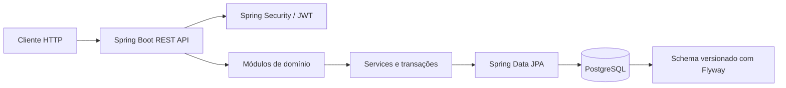
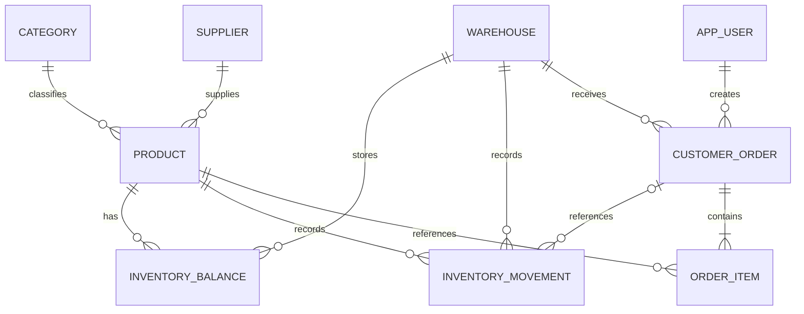

# GerenciamentíssimoFlow

API REST para gestão B2B de estoque, depósitos e pedidos, construída como um monólito modular para demonstrar regras de negócio transacionais e testáveis.

[](https://github.com/dreagas/gerenciamentissimoflow/actions/workflows/validation.yml)


O badge do Actions apresenta o estado publicado pelo GitHub quando disponível; este commit não foi executado em CI remoto. Não há URL de demo pública ou licença declarada.

## Stack

- Java 21, Spring Boot 4.0.8 e Maven Wrapper;
- Spring Web, Security, Data JPA, Bean Validation e Actuator;
- PostgreSQL e migrações Flyway;
- JWT para autenticação e autorização por papéis;
- OpenAPI/Swagger UI;
- JUnit, Spring Test e PostgreSQL Testcontainers;
- Docker / Docker Compose e GitHub Actions para validação.

## Funcionalidades

- Gestão de usuários, categorias, produtos, fornecedores e depósitos;
- saldos por produto e depósito, recebimentos, ajustes e relatórios CSV;
- pedidos em rascunho, confirmação, cancelamento e atendimento;
- dashboard operacional e eventos de auditoria;
- API versionada sob `/api/v1` e documentação OpenAPI.

## Destaques técnicos

- Confirmação e cancelamento de pedidos coordenam atualização de estado e estoque em transações;
- proteção concorrente no estoque é validada com testes de integração PostgreSQL/Testcontainers;
- `Idempotency-Key` opcional na confirmação previne consumo duplicado em retries;
- migrations Flyway e constraints do banco preservam invariantes persistentes;
- Spring Security aplica JWT, RBAC e proteção CSRF em operações de escrita;
- identificadores de correlação são aceitos/gerados com validação segura.

## Arquitetura

Monólito modular organizado por domínio (`auth`, `product`, `inventory`, `order`, entre outros). Controllers expõem contratos HTTP; services coordenam casos de uso/transações; repositories encapsulam persistência.



Mais detalhes: [arquitetura](docs/ARCHITECTURE.md), [decisões](docs/DECISIONS.md) e [exemplos de API](docs/API_EXAMPLES.md).

## Modelo de domínio (resumo)



Fornecedores/categorias podem ser opcionais em produtos. Saldos são únicos por combinação produto-depósito; cada pedido pertence a um depósito e contém itens referenciando produtos.

## Executar localmente

Requisitos: JDK 21 e Docker com Compose. Copie `.env.example` para `.env` (ignorado pelo Git) e substitua cada placeholder por valores fictícios exclusivos para desenvolvimento local. O Compose exige senha do banco, senha do administrador demo e segredo JWT externo; não reutilize segredos de produção. Para execução sem Compose, configure `DB_URL`, `DB_USERNAME`, `DB_PASSWORD`, `JWT_SECRET` e, no profile demo, `DEMO_ADMIN_PASSWORD`; `CORS_ALLOWED_ORIGINS` limita origens permitidas. `JWT_EXPIRATION_SECONDS` é opcional (padrão: 3600). `SPRING_PROFILES_ACTIVE` seleciona o profile (Compose usa `demo`; padrão da aplicação é `dev`).

```powershell
docker compose up --build
```

A aplicação fica em `http://localhost:8080`. Health: `http://localhost:8080/actuator/health`; Swagger UI: `http://localhost:8080/swagger-ui/index.html`.

Para executar a aplicação localmente sem Docker, inicie PostgreSQL com o banco definido em `DB_URL` e rode `./mvnw spring-boot:run` (Windows: `mvnw.cmd spring-boot:run`), configurando antes as variáveis necessárias. O profile `dev` usa valores locais padrão documentados em `application-dev.yml`; não os reutilize fora do desenvolvimento. O profile demo requer credenciais configuradas externamente. Não há senha demo embutida ou conta pública anunciada. Consulte [deployment](docs/DEPLOYMENT.md) para configuração e limites antes de expor o serviço.

## Testes

```powershell
.\mvnw.cmd test
.\mvnw.cmd verify
```

Os testes de integração PostgreSQL usam Testcontainers e requerem Docker. O workflow GitHub Actions executa `./mvnw verify` em pushes e pull requests direcionados a `main`; CI valida o projeto e não publica nem faz deploy.

## API

Rotas principais incluem autenticação, usuários administrativos, produtos, categorias, fornecedores, depósitos, estoque, pedidos, dashboard e auditoria. Os exemplos de [API](docs/API_EXAMPLES.md) usam placeholders e não contêm tokens ou credenciais reutilizáveis.

## Operação e segurança

Configuração de banco, JWT e CORS deve vir do ambiente, nunca de valores versionados. Produção requer secret JWT forte, CORS restrito, credenciais próprias e revisão operacional. A preparação descrita em [docs/DEPLOYMENT.md](docs/DEPLOYMENT.md) não representa um deploy existente ou autorizado.

## Estado do projeto

Projeto de portfólio em evolução. Não há demo pública, URL de produção, benchmark publicado ou licença declarada.
