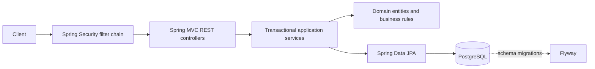

# Architecture overview

GerenciamentíssimoFlow is a Spring Boot modular monolith. Each business area owns its JPA entities, repositories, services, and REST controllers under `com.dreagas.gerenciamentissimoflow`.

## Request and persistence flow

Controllers validate request records and delegate to services. Services form transaction boundaries and compose domain operations. Repositories persist the resulting state. Flyway owns schema evolution; Hibernate validates the mapped schema rather than generating production DDL.

## Inventory/order consistency

Order confirmation is transactional: it locks the order, locks affected inventory balances in stable product-ID order, validates all quantities, then writes stock movements and changes order state. A PostgreSQL integration race asserts one success and one insufficient-stock outcome. Balance rows additionally use optimistic versioning. Confirmation idempotency records actor/key/order in the same transaction. See [`DECISIONS.md`](DECISIONS.md) for the locking rationale.

## Security and profiles

The Spring Security filter chain applies configured CORS, role rules, and sanitized 401/403 responses. Admin audit/user routes are restricted. Important current limitation: a production JWT login/token validation flow is not implemented; C-02 remains pending in the V1 plan. Profiles are `dev`, `test`, `demo`, and `prod`; demo data seeding is also pending, so demo currently means configuration/OpenAPI profile rather than populated accounts.

Actuator exposes only health/info. OpenAPI is enabled in dev/demo and disabled in prod. Local Compose defines PostgreSQL and the application; the Docker image uses a separate build and non-root runtime stage.
